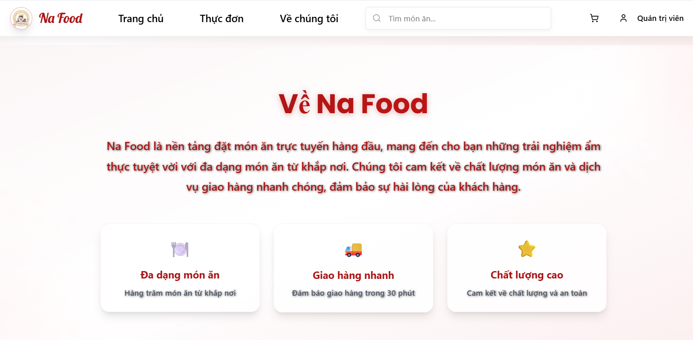
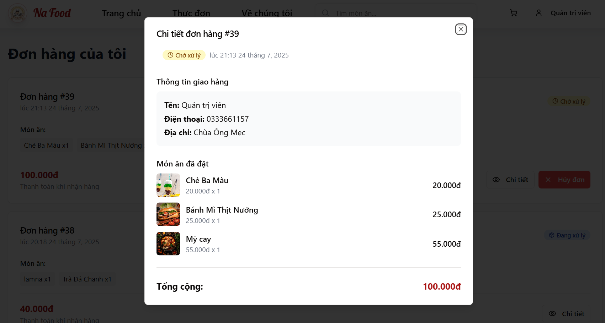
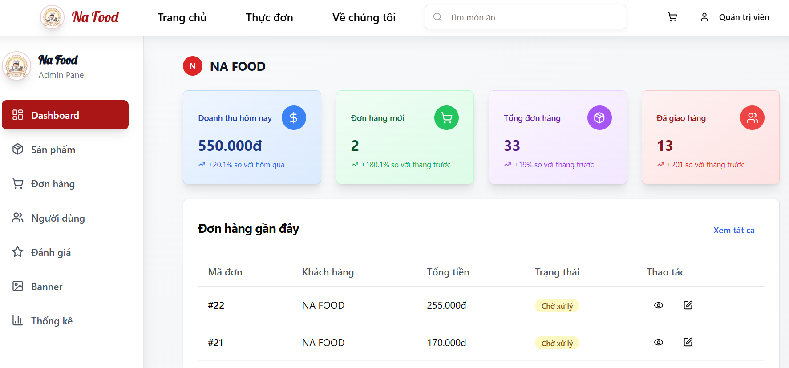
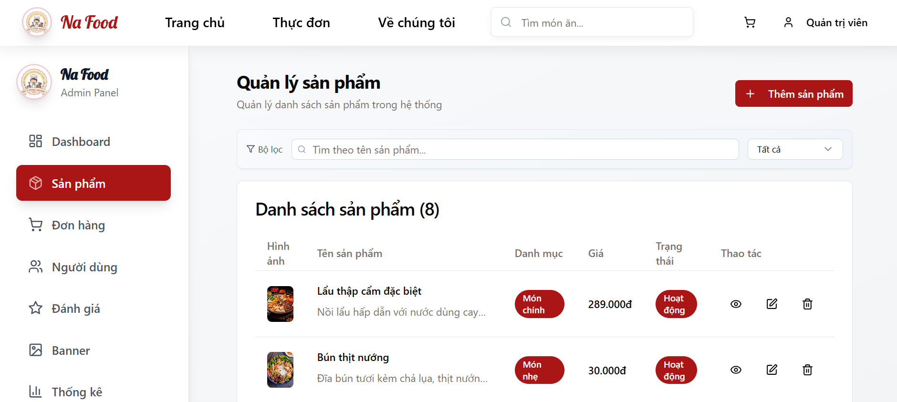
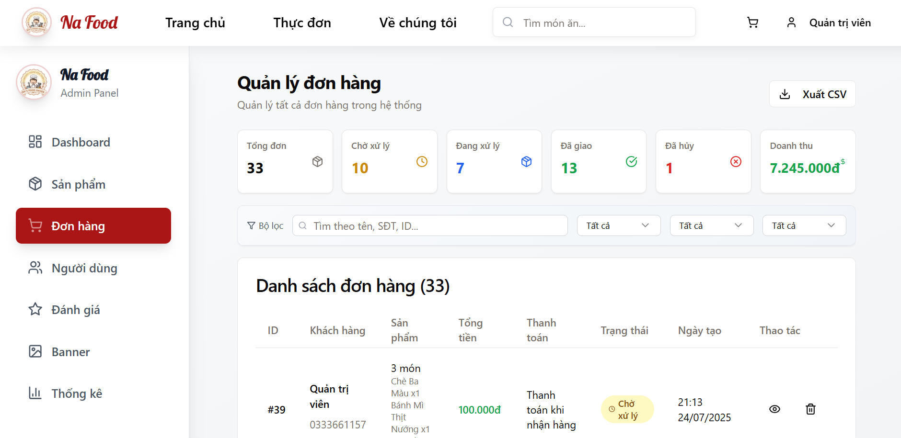

# � Na Food - Hệ thống quản lý cửa hàng thực phẩm

<div align="center">
  
  
  
  
  
  
</div>

<div align="center">
  <h3>🚀 Hệ thống cửa hàng thực phẩm hiện đại và chuyên nghiệp</h3>
  <p>Được xây dựng với công nghệ full-stack JavaScript, hỗ trợ đa vai trò người dùng và quản lý bán hàng thông minh</p>
</div>

---

## 📸 Giao diện ứng dụng

### 🏠 Trang chủ

*Giao diện trang chủ với banner quảng cáo và menu điều hướng hiện đại*

### 🍽️ Thực đơn

*Danh sách món ăn đa dạng với hình ảnh hấp dẫn*

### ℹ️ Về chúng tôi

*Trang giới thiệu về nhà hàng và dịch vụ*

### � Đơn hàng của tôi

*Theo dõi trạng thái đơn hàng real-time*

### 👨‍� Dashboard Admin

*Bảng điều khiển quản trị với thống kê tổng quan*

### 🛍️ Quản lý sản phẩm

*Giao diện quản lý sản phẩm cho admin*

### 📋 Quản lý đơn hàng

*Hệ thống quản lý đơn hàng chuyên nghiệp*

---

## ✨ Tính năng nổi bật

### 👥 **Hệ thống đa vai trò**
- 🔐 **Admin**: Quản lý toàn bộ hệ thống, thống kê doanh thu
- 👨‍💼 **Staff**: Xử lý đơn hàng và chăm sóc khách hàng
- 👤 **Customer**: Đặt món và theo dõi đơn hàng real-time

### 🛍️ **Quản lý sản phẩm thông minh**
- 📸 Upload và tự động nén hình ảnh
- 🏷️ Phân loại món ăn chi tiết theo danh mục
- ⭐ Hệ thống đánh giá và review
- 🔍 Tìm kiếm và lọc sản phẩm thông minh

### 🛒 **Giỏ hàng & Thanh toán**
- 💾 Lưu trữ real-time với localStorage
- 💳 Đa phương thức thanh toán
- 📱 Responsive hoàn hảo trên mọi thiết bị
- 🔔 Thông báo trạng thái đơn hàng tức thời

### 📊 **Dashboard & Báo cáo**
- 📈 Thống kê doanh thu và đơn hàng chi tiết
- 📋 Xuất báo cáo PDF và CSV
- 📊 Biểu đồ trực quan với Recharts
- 🎯 Phân tích hiệu suất kinh doanh

---

## 🛠️ Công nghệ sử dụng

### 🎨 **Frontend**
- **React 18** - UI framework hiện đại
- **Vite** - Build tool nhanh chóng
- **Tailwind CSS** - Utility-first CSS framework
- **React Query** - Data fetching & caching
- **React Hook Form** - Form management
- **Recharts** - Beautiful charts

### ⚙️ **Backend**
- **Node.js** - JavaScript runtime
- **Express.js** - Web framework
- **MongoDB Atlas** - Cloud database
- **Mongoose** - MongoDB ODM
- **JWT** - Authentication
- **Swagger** - API documentation

---

## 🚀 Cài đặt và chạy

### 📋 **Yêu cầu hệ thống**
- Node.js >= 18.0.0
- npm hoặc yarn
- Docker (tùy chọn)

### ⚡ **Cài đặt nhanh**

```bash
# Clone repository
git clone https://github.com/your-username/nafood.git
cd nafood

# Cài đặt dependencies
npm install
cd client && npm install && cd ..

# Tạo file .env (sử dụng MongoDB Atlas)
echo "MONGODB_URI=your-mongodb-atlas-connection-string" > .env
echo "JWT_SECRET=your-secret-key" >> .env
```

### 🏃‍♂️ **Chạy ứng dụng**

**Development mode:**
```bash
# Terminal 1: Backend
node server/index.js

# Terminal 2: Frontend
cd client && npm run dev
```

**Production mode:**
```bash
npm run build
npm run start:prod
```

### 🐳 **Chạy với Docker**

```bash
# Di chuyển vào thư mục Docker
cd CONGNGHEPHANMEM

# Dọn dẹp containers cũ
docker-compose down --remove-orphans

# Build và khởi động
docker-compose up -d --build

# Kiểm tra trạng thái
docker-compose ps
```

---

## 🌐 Truy cập ứng dụng

- **Frontend**: http://localhost:5173
- **Backend API**: http://localhost:3000
- **Swagger Documentation**: http://localhost:3000/api-docs
- **Health Check**: http://localhost:3000/api/health

---

## 📁 Cấu trúc dự án

```
nafood/
├── 📂 client/              # React frontend
│   ├── 📂 src/
│   │   ├── 📂 components/  # UI components
│   │   ├── 📂 pages/       # Page components
│   │   ├── 📂 lib/         # Utilities & hooks
│   │   └── 📂 styles/      # CSS files
├── 📂 server/              # Express backend
│   ├── 📄 index.js         # Server entry point
│   ├── 📄 routes.js        # API routes
│   ├── 📄 storage.js       # Database operations
│   └── 📄 swagger.js       # API documentation
├── 📂 shared/              # Shared schemas
├── 📂 data/                # Sample data
├── 📂 public/              # Static files
├── 📂 CONGNGHEPHANMEM/     # Docker configuration
└── 📄 package.json         # Dependencies
```

---

## 🎯 API Endpoints

### 🔐 Authentication
- `POST /api/auth/register` - Đăng ký tài khoản
- `POST /api/auth/login` - Đăng nhập
- `POST /api/auth/logout` - Đăng xuất

### 🛍️ Products
- `GET /api/products` - Lấy danh sách sản phẩm
- `POST /api/products` - Tạo sản phẩm mới
- `PUT /api/products/:id` - Cập nhật sản phẩm
- `DELETE /api/products/:id` - Xóa sản phẩm

### 🛒 Orders
- `GET /api/orders` - Lấy danh sách đơn hàng
- `POST /api/orders` - Tạo đơn hàng mới
- `PUT /api/orders/:id` - Cập nhật trạng thái đơn hàng

---

## 🤝 Đóng góp

1. Fork repository
2. Tạo feature branch (`git checkout -b feature/AmazingFeature`)
3. Commit changes (`git commit -m 'Add some AmazingFeature'`)
4. Push to branch (`git push origin feature/AmazingFeature`)
5. Tạo Pull Request

---

## 📄 License

Distributed under the MIT License. See `LICENSE` for more information.

---

## 📞 Liên hệ

- **Project Link**: [https://github.com/your-username/nafood](https://github.com/your-username/nafood)
- **Demo**: [https://nafood-demo.vercel.app](https://nafood-demo.vercel.app)

---

<div align="center">
  <p>Made with ❤️ by Na Food Team</p>
  <p>⭐ Star this repo if you find it helpful!</p>
</div>


